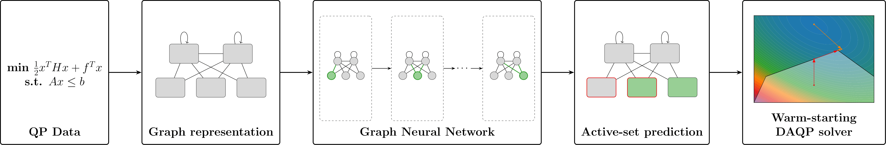

# Warm-starting Active-Set Solvers Using Graph Neural Networks

This repository contains the code for the paper [Warm-starting active-set solvers using graph neural networks](https://arxiv.org/abs/2511.13174) by [Ella J. Schmidtobreick](https://ellaschmidtobreick.github.io/), [Daniel Arnström](https://darnstrom.github.io/), [Paul Häusner](https://paulhausner.github.io/), and [Jens Sjölund](https://jsjol.github.io/).

---

## Overview

This repository contains implementations and experiments for learning-based warm-starting of active-set methods for quadratic programming (QP) problems using graph neural networks (GNNs).



Quadratic programs are represented as graphs, where variables and constraints form nodes and the optimization structure is encoded through edges and node features. A GNN is trained to predict active-set related quantities that can be used to initialize the solver and improve optimization performance.

The repository includes:
- QP and graph dataset generation,
- training pipelines for GNN and MLP models,
- evaluation and scaling experiments,
- plotting utilities,
- and experiments on varying problem sizes and structures.

---

## Data

Most of the data is synthetic data, while lmpc refers to the MPC problem of an inverted pendulum on a cart.
The data is generated using the following files:

```
generate_mpqp_v2.py
generate_graph_data.py
generate_MLP_data.py
generate_lmpc.py
```

---

## Experiments

The repository contains experiments for:
- GNN vs. MLP comparisons,
- scaling behavior,
- and learned warm-starting in LMPC settings.

Experiment scripts are located in the following files:

```text
experiment1_scaling.py
experiment2_multi.py
experiment3_lmpc.py
```

---

## Results

The learned warm-start strategies reduce active-set solver iterations and improve solve times across several QP settings.

Generated plots, included in the paper, can be found in the `plots/` directory.

---

## Citation

If you use this code, please cite:

```bibtex
@inproceedings{schmidtobreick2026warmstarting,
  title={Warm-starting active-set solvers using graph neural networks},
  author={Ella J. Schmidtobreick and Daniel Arnström and Paul Häusner and Jens Sjölund},
  booktitle={8th Annual Learning for Dynamics and Control Conference},
  year={2026},
  url={https://openreview.net/forum?id=EWb9XMamzM}
}
```

---

## Contact
If you have any questions, please reach out to [ella-johanna.schmidtobreick@it.uu.se](mailto:ella-johanna.schmidtobreick@it.uu.se).